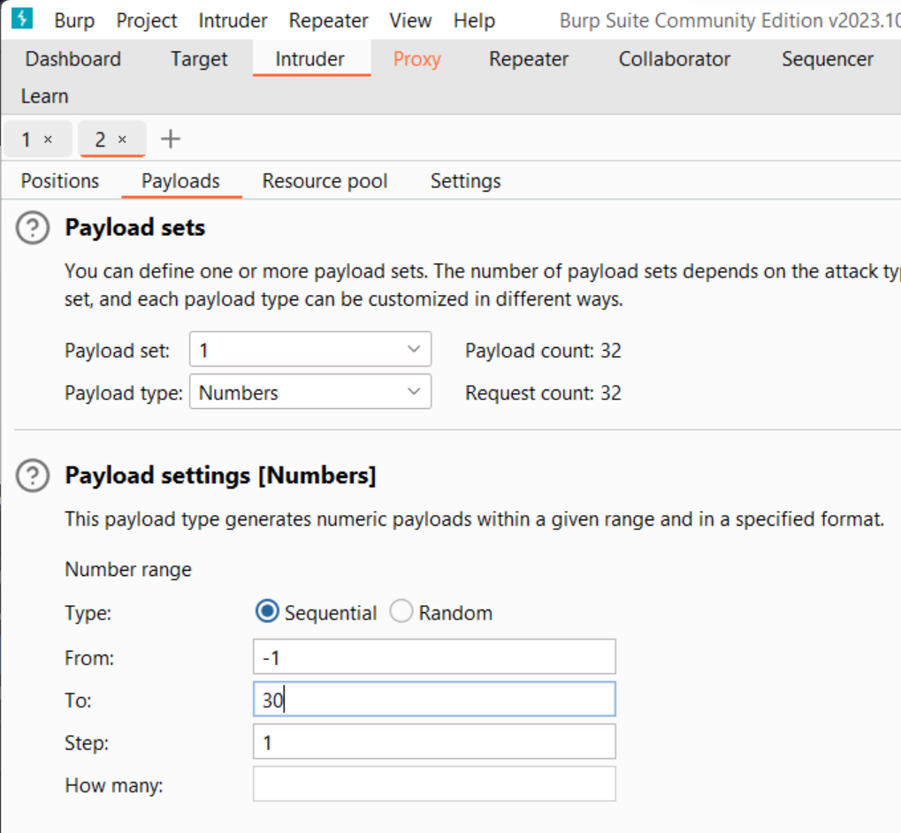

## `Challenge :  Get aHEAD `
`Author: madStacks`

**Description** : 
- Find the flag being held on this server to get ahead of the competition
 
**Hints** :
- Maybe you have more than 2 choices
- Check out tools like Burpsuite to modify your requests and look at the responses

**Giải quyết** :
1. Gợi ý đầu tiên nói cho ta rằng ta có thể có nhiều hơn 2 lựa chọn. Vậy ta thử kiểm tra xem `2 lựa chọn` được nói đến là cái gì.
2. Đầu tiên check thử source code : 

Ta thấy có 2 sự khác biệt đó là `HTTP Request Methods`, có thể có lựa chọn phương thức thứ 3 ngoài 2 phương thức trên chăng?

Có tất cả 9 loại request :
```
GET: được sử dụng để lấy thông tin từ sever theo URI đã cung cấp.
HEAD: giống với GET nhưng response trả về không có body, chỉ có header
POST: gửi thông tin tới sever thông qua các biểu mẫu http
PUT: ghi đè tất cả thông tin của đối tượng với những gì được gửi lên
PATCH: ghi đè các thông tin được thay đổi của đối tượng.
DELETE: xóa tài nguyên trên server.
CONNECT: thiết lập một kết nối tới server theo URI.
OPTIONS: mô tả các tùy chọn giao tiếp cho resource.
TRACE: trình bày một vòng lặp kiểm tra thông báo song song với path tới nguồn mục tiêu.
```

3. Nhìn vào tên tiêu đề của thử thách ta thấy rằng `Head` có được nhắc đến , cho nên ta thử đổi thành phương thức `HEAD` thông qua công cụ `Burp Suit`


Vậy flag là : picoCTF{r3j3ct_th3_du4l1ty_2e5ba39f}


## `Challenge :  Cookies `
`Author: madStacks`
**Description**:
- Who doesn't love cookies? Try to figure out the best one. http://mercury.picoctf.net:6418/

1. Vì bài này liên quan đến cookies nên ta thử kiểm tra giá trị cookies ban đầu 


Ta có `value = -1`

2. Tiếp theo ta nhập thử dòng dữ gợi ý `snickerdoodle` vào xem sao


Lúc này thì `value = 0`

3. Từ đây ta nghĩ ngay tới việc thay đổi `value` của cookies để tìm flag. Chúng ta sẽ sử dụng tính năng `Intruder` để thực hiện `bruce force` dò `value`


Ta thử dò giá trị từ -1 đến 30


Và để dễ nhận biết được kết quả trả về thì ta thêm vào options `Grep-Match` để lọc những kết quả có chứa chuỗi `flag` và `picoCTF{`


4. `Start attack`


Vậy flag là : picoCTF{3v3ry1_l0v3s_c00k135_88acab36}