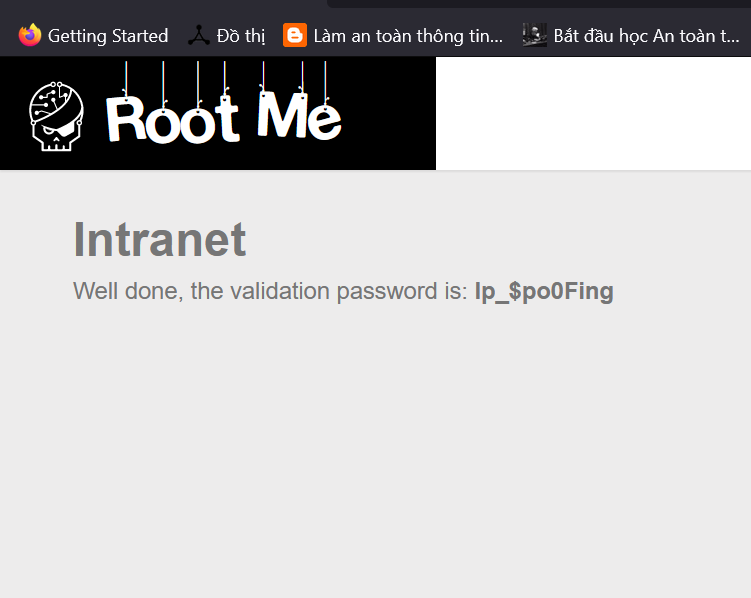
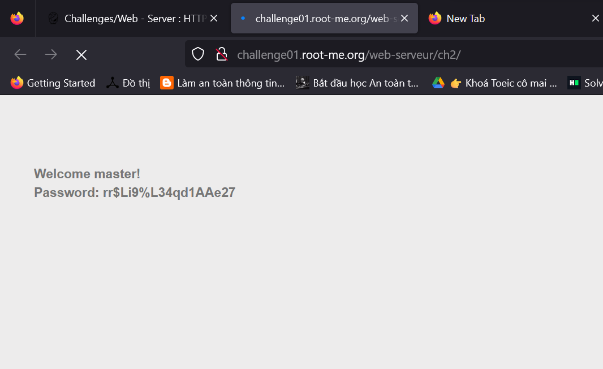
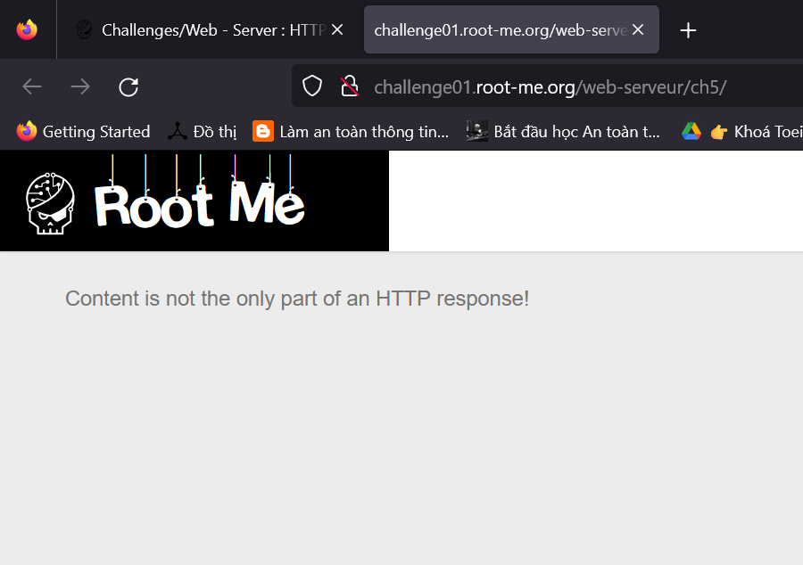

## `HTTP - IP restriction bypass`
**Only local users will be able to access the page**

Yêu cầu : 
- Dear colleagues,
- We’re now managing connections to the intranet using private IP addresses, so it’s no longer necessary to login with a username / password when you are already connected to the internal company network.
Regards,
The network admin

1. Thử thách cung cấp cho ta trang web như sau 

Và địa chỉ ip được gán một cách tự động .
2. Đề bài yêu cầu phải là `local user` thì sẽ có thể đăng nhập mà không cần mật khẩu, do vậy ta chỉ cần sửa thành một địa chỉ ip hợp lệ là được , bạn có thể gõ câu lệnh `ipconfig` để lấy địa chỉ ipv4 của bạn. Sau khi có được địa chỉ ip hợp lệ ta chi cần sửa thông qua Header `X-Forwarded-For`
- Header X-Forwarded-For thường được sử dụng để truyền đạt thông tin về địa chỉ IP của client khi có các proxy ở giữa client và máy chủ web. Mục đích là giúp máy chủ web có thể biết đến địa chỉ IP của người dùng cuối cùng mặc dù có các lớp trung gian.
3. Thêm vào Header `X-Forwarded-For:192.168.43.58`

4. `Forward` và ta được kết quả :

Mật khẩu : Ip_$po0Fing  

## `HTTP - User-agent`
`Author : g0uZ`

NOTE : User-Agent: cung cấp thông tin về trình duyệt hoặc phần mềm client khác đã tạo ra yêu cầu.

Challenge cung cấp cho chúng ta một trang web như sau 

1. Với dòng chữ  `Wrong user-agent: you are not the "admin" browser!`
2. Câu trên nói rằng ta không phải `admin` browser!
3. Vậy thì ta chỉ cần sửa lại giá trị `user-agent` thành `admin` là xong

Mật khẩu : rr$Li9%L34qd1AAe27

## `HTTP - Headers`

Yêu cầu : Get an administrator access to the webpage.

1. Truy cập thử thách ta được trang web như sau 

2. Dùng burp suit để bắt thử 

3. Ta thấy ta dòng `Header-RootMe-Admin: none`

4. Cho nên ta chỉ cần thêm dòng `Header-RootMe-Admin: true` vào request là sẽ ra kết quả :

Mật khẩu : HeadersMayBeUseful

## `HTTP - POST`
`Author : Th1b4ud`

Yêu cầu : Find a way to beat the top score!

Thử thách cung cấp cho ta một trang web như sau :

1. Bài này là trò chơi random nếu số điểm random lớn hơn 999999 thì mới win :v
2. Thử dùng burp suit để chỉnh sửa `score=1000000`

3. Và kết quả là 

Mật khẩu : H7tp_h4s_N0_s3Cr37S_F0r_y0U
